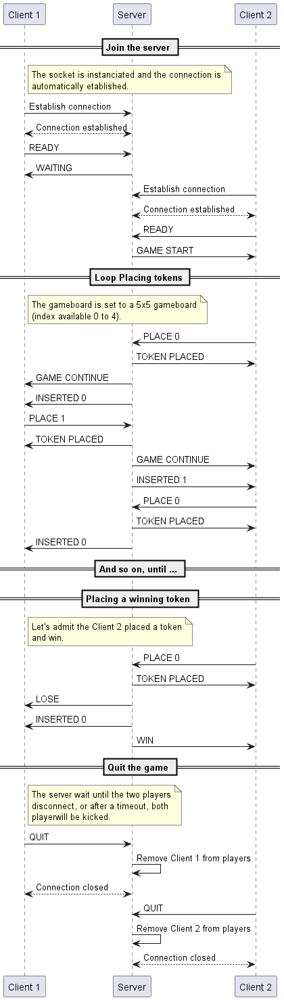
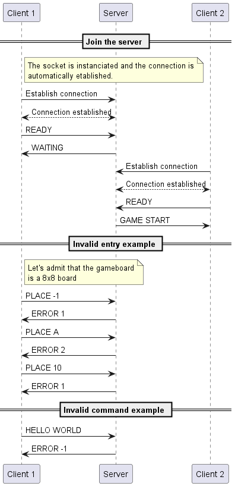

# The Connect 4 protocol 

Pour le travail de laboratoire, nous devons développer une application

# Section 1 - Overview
The "Connect 4" protocol is a communication protocol that allows two clients to play against each 
other on a board generated and managed by the server.
# Section 2 - Transport protocol
The "Connect 4" protocol is a text transport protocol. It uses the TCP transport protocol to ensure the reliability of data transmission. The port it uses is the port number 6433. We selected this port for no particular reason other that it isn't used by default and it is the one used for an exercice.

Every message must be encoded in UTF-8 and delimited by a newline character (\n). The messages are treated as text messages.

The initial connection must be established by the clients.

Once one connection is established, the server gets into a waiting state.

When two players send a ready state, the game can start.

Each client can then take turns to send a column where he wants to place a token.

The server's role is to verify if the received column number is valid (is it even a number?) and in between given bounds.

If these conditions are met, the server will add the token to it's gameboard and process the result before sending the board infos to both player clients.

Otherwise, the server sends an error message to the client.

The error must specify which condition has not been met.

On an unknown message, the server must send an error to both clients.

Once the game ends, the server send a GameOver message to both player clients and wait for X seconds. When the wait is done, the server disconnects both players, the server returns to the waiting state with both players already connected but no ready for the next game. (Maybe disconnect both players so other players can join more easily)

# Section 3 - Messages

## Saying ready

The client notifies a ready state when he wants to start the game
(A player slot is set to occupied as soon as he joins ->
other players cannot join as soon as 2 player slots are occupied)
The ready state only serves as waiting time before the
game start.

### Request

``` text
READY
```

### Response

- `WAITING` : If the player is the first, he waits for
another player to join and be ready.
- `GAME START` : The game starts because two players are ready, and the player who receive this, will play first.

## Place a token in the grid

The client sends a column to the server indicating the column number
where he want to place his token.

### Request

``` text
PLACE <colomn number>
```

### Reponse to the player who placed the token
  
- `INVALID`      : The desired column is non-existent in the gameboard
- `COLUMN FULL`  : The desired column is already filled with tokens.
- `WIN`          : The placed token results in a Win of the player.
- `DRAW`         : The placed token fills the gameboard completely resulting in a draw.
- `TOKEN PLACED` : The placed token is placed propreply in the column, the game continues.

### Reponse to the player who didn't placed the token

The second response is the response that is sent to the other player, to indicate where the
new token has been placed

- `INSERTED <column number>` : The placed token by the other player is indicated to the waiting player.
- `GAME CONTINUE` : The placed token by the other player did not succes to a win or a draw, so the game continues.
- `LOSE`   : The placed token by the other player results in a loss of the game.
- `DRAW`   : The placed token by the other player results in a draw of the game.

## Forfeit

The client want to FF.

### Request

``` text
FF
```

### Response

- `LOSE` : A player declared forfeit and results in a Loss of the player.
- `WIN`  : A player declared forfeit and results in a Win of the player.

## Quit the server

### Request

``` text
QUIT
```

### Response

None.

## Invalid message

If the server receives an unknown message, it must send an error message to the client.

### Response

- `ERROR <code>` : an error occurred while sending the message. The error code is an integer between -1 and -1 inclusive. 
The error code is as follow:
  - -1: invalid message

# Section 4 - Examples

## Functionnal example



## Invalid command or input example


