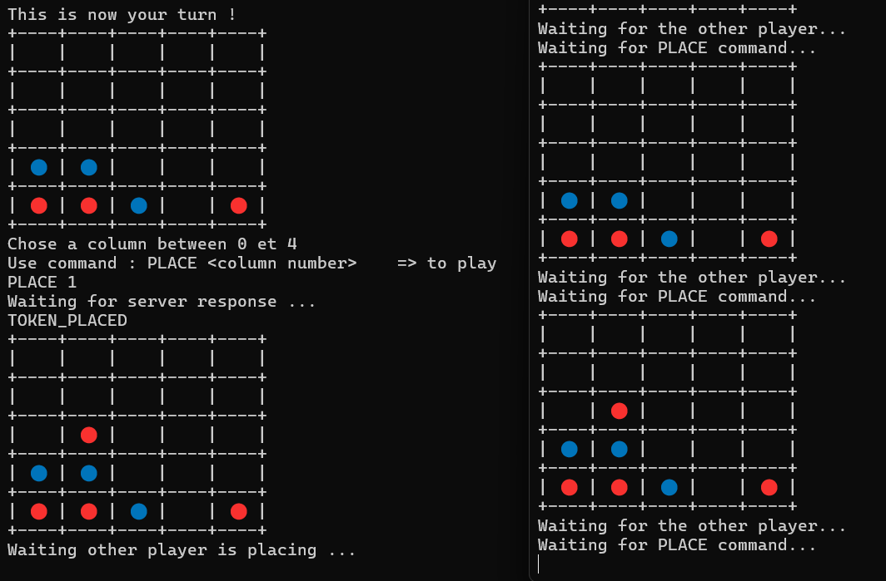

# DAI_Practical2_Connect4
## Description

The Command-Line Connect Four project is a console-based implementation of the classic Connect Four game. It provides an interactive and straightforward interface where two players can compete in turns, placing their tokens on a grid to form a winning sequence. The project emphasizes game logic, board rendering, and user interaction through textual input and output.

Since we use network communication, we had to define a protocol to transmit the data from a client to the server

## Previsualisation

> Here you can see a small previsualation of the projet. On the left of the image, there is one client side and on the right side of the image, there is the server side.



## Basic Tools

To run tbis project, you will need at least, this java version :

```shell
openjdk 21.0.4 2024-07-16 LTS
OpenJDK Runtime Environment Temurin-21.0.4+7 (build 21.0.4+7-LTS)
OpenJDK 64-Bit Server VM Temurin-21.0.4+7 (build 21.0.4+7-LTS, mixed mode, sharing)
```

## Dependencies
### PicoCLI
The only dependency we are using in this project is PicoClI to implement easily the differents commands.

## Cloning the Repository
To get started, clone the repository using the following command:

```shell
git clone https://github.com/thomasstaheli/DAI_Practical2_Connect4.git
cd DAI_Practical2_Connect4
```
## Build the Project (JAR)
To build the JAR, run the following command from the root of the repository:

```shell
./mvnw dependency:go-offline clean compile package
``` 

## Docker

### Build

```shell
docker build -t connect4 .
```

### Publish

If you want to publish your docker image, plesae follow those steps :

#### Connection at Github Container Registry

```shell
docker login ghcr.io -u <username>
```

#### Tag the image

```shell
docker tag connect4 ghcr.io/<username>/connect4:latest
```

#### Publish the image

```shell
docker push ghcr.io/<username>/connect4
```
### Pull the image

```shell
docker pull ghcr.io/<username>/connect4
```

If you want to pull the image of this project :

```shell
docker pull ghcr.io/thomasstaheli/connect4
```

## Run as Server

For the server and the client, there is two possibilities to run the project. 

### Default values

> default value `<port>` : 6433
 
> default value `<board height>` : 5
 
> default value `<board width>` : 5

> default value `<win lenght condition>` : 4

### With Docker

> `<exposed port>` = exposed port on your current machine

> `<port container>` = exposed port on container
```shell
docker run -p <exposed port>:<port container> connect4 server -p <port> -h <board height> -w <board width> -wl <win lenght condition>
```
Example :
```shell
docker run -p 6433:6433 connect4 server
```

### Whithout Doccker

```shell
java -jar target/DAI_Practical2_Connect4-1.0-SNAPSHOT.jar server -p <port> -h <board height> -w <board width> -wl <win lenght condition>
```
Example :

You can run with the default value :
```shell
java -jar target/DAI_Practical2_Connect4-1.0-SNAPSHOT.jar server 
```

Or width other values :

```shell
java -jar target/DAI_Practical2_Connect4-1.0-SNAPSHOT.jar server  -p 6464 -h 10 -w 10 -wl 6
```

## Run as Client

### Default values

> default value `<port>` : 6433
 
> default value `<ip>` : 127.0.0.1

### With Docker

Le client se connecte sur le port <exposed port>
```shell
docker run -it connect4 client -p <port> -a <ip>
```

### Whithout Docker

```shell
java -jar target/DAI_Practical2_Connect4-1.0-SNAPSHOT.jar client -p <port> --ip <ip>
```

Example :
You can run with the default value :
```shell
java -jar target/DAI_Practical2_Connect4-1.0-SNAPSHOT.jar client
```

Or width other values :

```shell
java -jar target/DAI_Practical2_Connect4-1.0-SNAPSHOT.jar client -p 6464 -a 172.16.32.24
```

## How to play the game

To play the game, you will need to have one server and two clients.

Use the PLACE command to place insert a token in a column :
```shell
PLACE <column number>
```
> If the board size is five, so you can enter en number between 0 and 4.

Use the FF15 command to stop the game (you don't have to wait 15 minutes before activating it) :
```shell
FF15
```

Have fun !

## Contributing
If you have any ideas to improve our project, just create a fork repository and open a pull-request !

Authors
- Thomas Stäheli
- Thirusan Rajadurai
